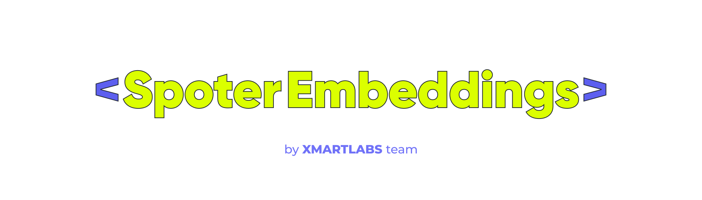

# SPOTER Embeddings

This repository contains code for the Spoter embedding model explained in [this blog post](https://blog.xmartlabs.com/blog/machine-learning-sign-language-recognition/).
The model is heavily based on [Spoter](https://github.com/matyasbohacek/spoter) which was presented in
[Sign Pose-Based Transformer for Word-Level Sign Language Recognition](https://openaccess.thecvf.com/content/WACV2022W/HADCV/html/Bohacek_Sign_Pose-Based_Transformer_for_Word-Level_Sign_Language_Recognition_WACVW_2022_paper.html) with one of the main modifications being
that this is an embedding model instead of a classification model.
This allows for several zero-shot tasks on unseen Sign Language datasets from around the world.
More details about this are shown in the blog post mentioned above.

## Modifications on [SPOTER](https://github.com/matyasbohacek/spoter)
Here is a list of the main modifications made on Spoter code and model architecture:

* The output layer is a linear layer but trained using triplet loss instead of CrossEntropyLoss. The output of the model
is therefore an embedding vector that can be used for several downstream tasks.
* We started using the keypoints dataset published by Spoter but later created new datasets using BlazePose from Mediapipe (as it is done in [Spoter 2](https://arxiv.org/abs/2210.00893)). This improves results considerably.
* We select batches in a way that they contain several hard triplets and then compute the loss on all hard triplets found in each batch.
* Some code refactoring to acomodate new classes we implemented.
* Minor code fix when using rotate augmentation to avoid exceptions.

_(1).gif)

## Results


We used the silhouette score to measure how well the clusters are defined during the training step.
Silhouette score will be high (close to 1) when all clusters of different classes are well separated from each other, and it will be low (close to -1) for the opposite.
Our best model reached 0.7 on the train set and 0.1 on validation.

### Classification accuracy
While the model was not trained with classification specifically in mind, it can still be used for that purpose.
Here we show top-1 and top-5 classifications which are calculated by taking the 1 (or 5) nearest vector of different classes, to the target vector.

To estimate the accuracy for LSA, we take a “train” set as given and then classify the holdout set based on the closest vectors from the “train” set.
This is done using the model trained on WLASL100 dataset only, to show how our model has zero-shot capabilities.


## Get Started

The recommended way of running code from this repo is by using **Docker**.

Clone this repository and run:
```
docker build -t spoter_embeddings .
docker run --rm -it --entrypoint=bash --gpus=all -v $PWD:/app spoter_embeddings
```

> Running without specifying the `entrypoint` will train the model with the hyperparameters specified in `train.sh`

If you prefer running in a **virtual environment** instead, then first install dependencies:

```shell
pip install -r requirements.txt
```

> We tested this using Python 3.7.13. Other versions may work.

To train the model, run `train.sh` in Docker or your virtual env.

The hyperparameters with their descriptions can be found in the [training/train_arguments.py](/training/train_arguments.py) file.


## Data

Same as with SPOTER, this model works on top of sequences of signers' skeletal data extracted from videos.
This means that the input data has a much lower dimension compared to using videos directly, and therefore the model is
quicker and lighter, while you can choose any SOTA body pose model to preprocess video.
This makes our model lightweight and able to run in real-time (for example, it takes around 40ms to process a 4-second
25 FPS video inside a web browser using onnxruntime)


For ready to use datasets refer to the [Spoter](https://github.com/matyasbohacek/spoter) repository.

For best results, we recommend building your own dataset by downloading a Sign language video dataset such as [WLASL](https://dxli94.github.io/WLASL/) and then using the `extract_mediapipe_landmarks.py` and `create_wlasl_landmarks_dataset.py` scripts to create a body keypoints datasets that can be used to train the Spoter embeddings model.

You can run these scripts as follows:
```bash
# This will extract landmarks from the downloaded videos
python3 preprocessing.py extract -videos <path_to_video_folder> --output-landmarks <path_to_landmarks_folder>

# This will create a dataset (csv file) with the first 100 classes, splitting 20% of it to the test set, and 80% for train
python3 preprocessing.py create -videos <path_to_video_folder> -lmks <path_to_landmarks_folder> --dataset-folder=<output_folder> --create-new-split -ts=0.2
```


## Example notebooks
There are two Jupyter notebooks included in the `notebooks` folder.
* embeddings_evaluation.ipynb: This notebook shows how to evaluate a model
* visualize_embeddings.ipynb: Model embeddings visualization, optionally with embedded input video


## Tracking experiments with ClearML
The code supports tracking experiments, datasets, and models in a ClearML server.
If you want to do this make sure to pass the following arguments to train.py:

```
    --dataset_loader=clearml
    --tracker=clearml
```

Also make sure to correctly configure your clearml.conf file.
If using Docker, you can map it into Docker adding these volumes when running `docker run`:

```
-v $HOME/clearml.conf:/root/clearml.conf -v $HOME/.clearml:/root/.clearml
```

## Model conversion

Follow these steps to convert your model to ONNX, TF or TFlite:
* Install the additional dependencies listed in `conversion_requirements.txt`. This is best done inside the Docker container.
* Run `python convert.py -c <PATH_TO_PYTORCH_CHECKPOINT>`. Add `-tf` if you want to export TensorFlow and TFlite models too.
* The output models should be generated in a folder named `converted_models`.

> You can test your model's performance in a web browser. Check out the README in the [web](/web/) folder.


## License

The **code** is published under the [Apache License 2.0](./LICENSE) which allows for both academic and commercial use if
relevant License and copyright notice is included, our work is cited and all changes are stated.

The license for the [WLASL](https://arxiv.org/pdf/1910.11006.pdf) and [LSA64](https://core.ac.uk/download/pdf/76495887.pdf) datasets used for experiments is, however, the [Attribution-NonCommercial 4.0 International (CC BY-NC 4.0)](https://creativecommons.org/licenses/by-nc/4.0/) license which allows only for non-commercial usage.
